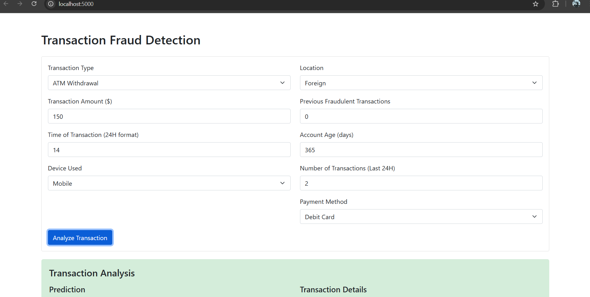
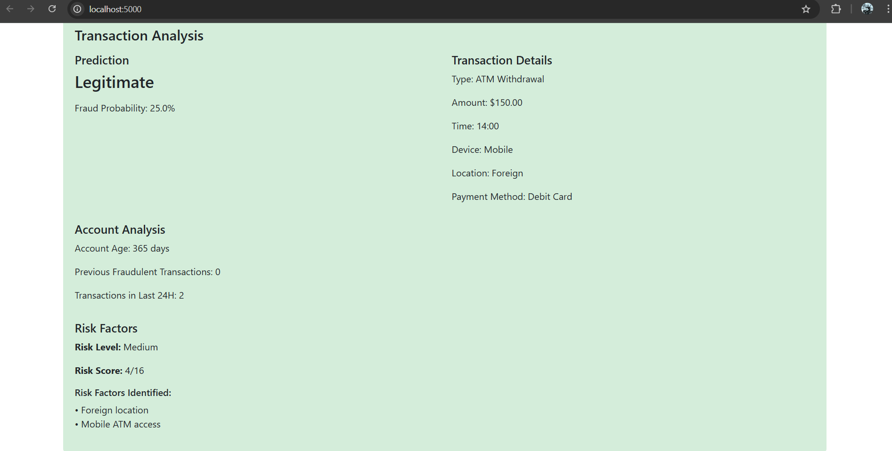
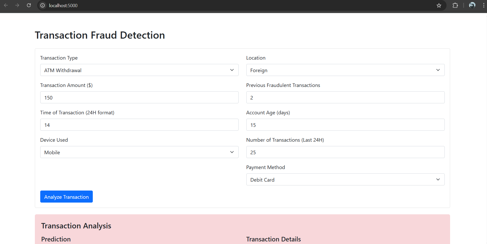
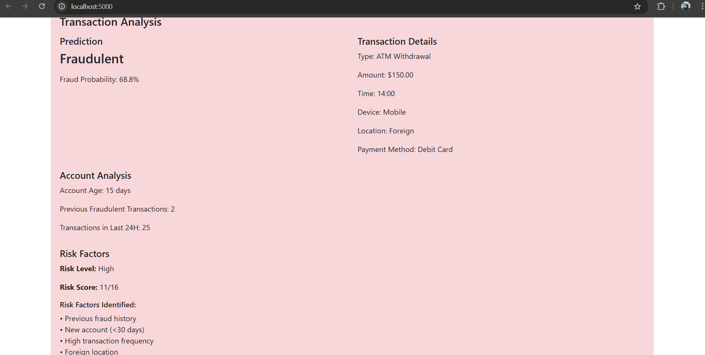
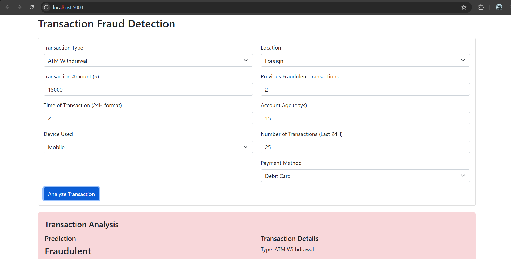
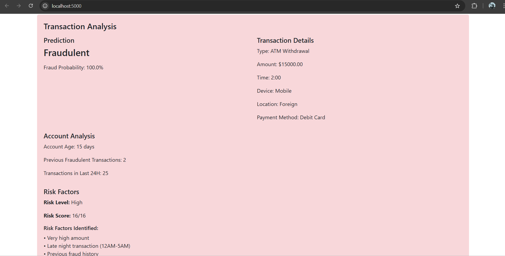

# Transaction Fraud Detection System

A hybrid fraud detection system that combines machine learning predictions with rule-based risk scoring for accurate fraud detection.

## Dataset

This project uses the [Transaction Fraud Detection Dataset](https://www.kaggle.com/datasets/ranjitmandal/fraud-detection-dataset-csv) from Kaggle, created by Ranjit Mandal. The dataset includes various transaction features that help in identifying fraudulent activities.

**Dataset Features:**
- Transaction amount
- Time of transaction
- Previous fraud history
- Account age
- Transaction frequency
- Location information
- Device information
- Transaction type

## Features

- Real-time transaction analysis
- Hybrid detection approach:
  - Machine Learning (Random Forest Classifier)
  - Rule-based Risk Scoring System
- Feature analysis:
  - Transaction amount
  - Time of transaction
  - Previous fraud history
  - Account age
  - Transaction frequency
  - Transaction type (ATM/Online)
  - Location (Local/Foreign)
  - Device used

## Tech Stack

- Python 3.x
- Flask (Web Framework)
- scikit-learn (Machine Learning)
- pandas (Data Processing)
- HTML/CSS (Frontend)
- Bootstrap 5 (UI Framework)

## Installation

1. Clone the repository:
```bash
git clone https://github.com/AjayKumbham/fraud-detection-app.git
cd fraud-detection-app
```

2. Install dependencies:
```bash
pip install -r requirements.txt
```

3. Run the application:
```bash
python src/app.py
```

4. Open http://localhost:5000 in your browser

## How It Works

The system uses a hybrid approach combining ML and rule-based detection:

1. **Machine Learning Model**
   - Random Forest Classifier
   - Standard scaling of numerical features
   - Binary encoding of categorical features
   - Feature importance analysis
   - Class weight balancing

2. **Risk Scoring System**
   - Rule-based scoring mechanism
   - Assigns risk points based on:
     - Large transactions (>$10,000)
     - Late night transactions (12 AM - 5 AM)
     - Previous fraud history
     - New accounts (<30 days)
     - High transaction frequency
     - Foreign locations
     - Mobile ATM access

3. **Combined Analysis**
   - ML model prediction
   - Risk score calculation
   - Final fraud probability
   - Detailed risk factor breakdown

## Usage

1. Enter transaction details:
   - Transaction amount
   - Time (0-23 hours)
   - Previous frauds
   - Account age (days)
   - Recent transactions
   - Transaction type
   - Location
   - Device used

2. Click "Analyze Transaction"

3. View results:
   - Final fraud prediction
   - ML model prediction
   - Risk score analysis
   - Contributing risk factors
   - Feature importance

## Project Structure

```
creditfraud-detection-app/
├── src/
│   └── app.py         # Main application code
├── templates/
│   └── index.html     # Web interface
├── data/
│   └── Fraud Detection Dataset.csv  # Training data
├── requirements.txt   # Dependencies
└── README.md         # Documentation
```
## Screenshots

### 1. Legitimate Transaction Input  
User enters transaction details that are classified as legitimate.  


### 2. Legitimate Transaction Analysis  
System confirms the transaction as legitimate and provides insights.  


### 3. Moderate-Risk Transaction Input  
User enters transaction details that are flagged as **moderate risk** (suspicious but not confirmed fraud).  


### 4. Moderate-Risk Transaction Analysis  
System provides a warning about the transaction's **moderate risk level**.  


### 5. Fraudulent Transaction Input  
User enters transaction details that are flagged as **high risk (fraudulent)**.  


### 6. Fraudulent Transaction Analysis  
System detects **fraud**, provides a probability score, and highlights risk factors.  



## Credits

- Dataset provided by [Ranjit Mandal on Kaggle](https://www.kaggle.com/datasets/ranjitmandal/fraud-detection-dataset-csv)
- Built with scikit-learn and Flask

## Contributing

Feel free to submit issues and enhancement requests!

## Testing & Quality

- Implemented **78 automated test cases** using pytest
- Achieved **100% passing test suite**
- Test coverage includes:
  - API endpoints
  - Machine learning predictions
  - Rule-based fraud scoring logic
- Ensures reliability and robustness of the system

## API Endpoints

### POST /predict

Analyze a transaction for fraud detection.

#### Request Body:
```json
{
  "amount": 5000,
  "time": 14,
  "prev_fraud": 1,
  "account_age": 100,
  "transactions_24h": 10,
  "txn_type": "Online Purchase",
  "location": "Local",
  "device": "Mobile"
}

{
  "status": "success",
  "prediction": "Fraudulent",
  "fraud_probability": "72.5%",
  "analysis": {
    "risk_analysis": {
      "score": "8/16",
      "level": "High"
    }
  }
}


---

## 💼 3. Add “Key Highlights” (VERY POWERFUL)

Add near top:

```md
## Key Highlights

- Hybrid fraud detection system combining ML + rule-based logic
- Built using Flask API and Random Forest model
- Achieved **100% passing (78 tests)** using pytest
- Handles real-time transaction analysis
- Designed for production-ready deployment